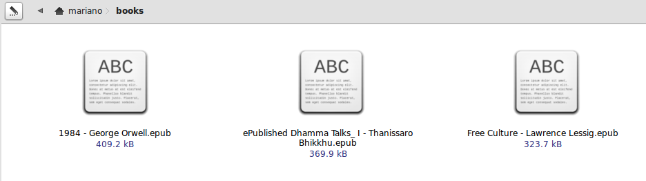
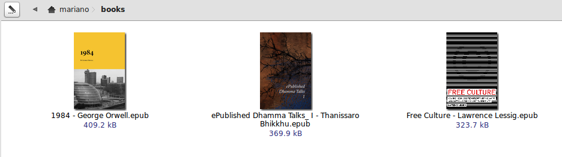

# What?
epub-thumbnailer is a simple script that tries to find a cover into an epub file and creates a thumbnail for it.

# Why?
Because I want my file manager (Nautilus, Thunar, Caja, et al.) to display nice thumnails for my epub ebooks, as it does for pdf files or images, to go from this:

to this:

# How to install?

### Requirement

 - [Pillow](https://python-pillow.org/) (see [installation instructions](https://pillow.readthedocs.io/en/stable/installation.html))

install it with `pip3 install Pillow` (you might need `sudo`) or with package manager from your distro

Run the installer!

    sudo python3 install.py install

Basically, it moves the thumbnailer script to /usr/bin and installs the necessary hooks:

- In gnome2, using a gconf schema (check src/epub-thumbnailer.schemas)
- In gnome3, using a thumbnailer entry (check src/epub.thumbnailer)

After installation, you might need to restart your file manager and remove cached thumbnails (~/.cache/thumbnails)

# Stand-alone

This will look into the **epub_file** to find its cover, and will save a **size** px png file as **output_file**

    epub-thumbnailer <epub_file> <output_file> <size>

# Acknowledgments

- [Marcelo Lira](https://github.com/setanta): Improved cover detection by filename
- [Pablo Jorge](https://github.com/pablojorge): Added manifest-based cover detection
- [Renato Ramonda](https://github.com/renatoram): Added gnome3 thumbnailer support
- [Dede Dindin Qudsy](https://github.com/xtrymind): Added tumbler configuration
- [Alex Chan](https://github.com/alexwlchan): Added Python 3 support
- A [couple](http://ubuntuforums.org/showthread.php?t=278162) of [forum](http://ubuntuforums.org/showthread.php?t=1046678) [topics](http://library.gnome.org/devel/integration-guide/stable/thumbnailer.html.en) where I learned about the matter
